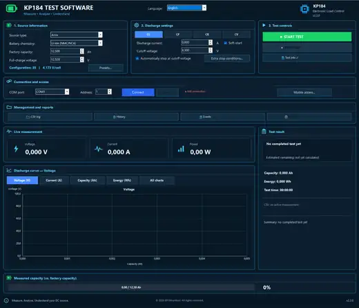

# KP184control

KP184control is a Windows desktop application for controlling and logging battery discharge tests with the **KUNKIN KP184 electronic load**.

> **Current release:** v2.3.0  
> **Interface languages:** English • Deutsch • Nederlands  
> **Source code:** proprietary / not publicly distributed.  
> **Copyright:** © 2026 Richard Uilenberg. All rights reserved.

## Screenshot

## Documentation

- [Nederlandse handleiding](HANDLEIDING_NL.md)
- [English user manual](USER_MANUAL_EN.md)
- [Deutsches Benutzerhandbuch](BENUTZERHANDBUCH_DE.md)
- [Changelog](CHANGELOG.md)
- [v2.3.0 release notes](RELEASE_NOTES_v2.3.0.md)

## Device compatibility

**KP184control v2.3.0 is hardware-validated for the KUNKIN KP184 with model ID `0x0730`.**

The application performs a compatibility/read-write check when connecting. Unknown device profiles may be read where possible, but KP184control will not enable the load unless a safe write profile has been confirmed.

## Main features

- Constant Current (**CC**) with software soft-start enabled by default.
- Constant Power (**CP/CW**).
- Constant Resistance (**CR**).
- Constant Voltage (**CV**) with additional startup current monitoring and safety warning.
- Automatic KP184 communication/profile detection and compatibility verification.
- Live voltage, current and power; Ah and Wh measurement.
- Automatic cutoff plus optional Ah, Wh and duration stop conditions.
- Communication watchdog and safe disconnect/reconnect/pause workflow.
- Manual resume after a successful reconnect; tests are never resumed automatically.
- Unexpected current-loss detection.
- Native KP184 slew-rate read/write.
- Runtime current/power watchdog and pre-start safety checks.
- CR low-current warning below approximately **0.15 A expected current**.
- Automatic graph scaling.
- Extended CSV logging with application version metadata.
- Battery Health and remaining-capacity estimation after a valid automatic cutoff.
- Single-page PDF test report with real test graphs.
- Local test presets and test history.
- Local mobile/web interface for monitoring and control on the same network.
- Mobile access modes: off, read-only and full control.
- Remote START/STOP support.
- Dutch, English and German UI/report support.

## Download

Download the latest release from the GitHub **Releases** section:

- `KP184control-v2.3.0-windows-x64.zip`
- `KP184control-v2.3.0-windows-x64-SHA256.txt`

### Windows package

The v2.3.0 Windows x64 package is published as a **self-contained** deployment. The Microsoft .NET runtime does **not** need to be installed separately.

SHA256 is provided so the downloaded ZIP can be checked for integrity.

## Safety

Electronic-load and battery testing can involve high current, heat, arcing, damaged cells, BMS protection events and fire risk. KP184control does not replace proper electrical protection or supervision.

Use correctly rated wiring, connectors and fusing; verify polarity before enabling the load; stay within the limits of both the battery and the KP184; and do not leave a test unattended.

Native CV does not provide a separately configurable hardware current limit. KP184control therefore adds software monitoring, but software protection is not a substitute for an external/hardware current limit where one is required.

## Source code and license

KP184control is **not open-source software**. The public repository intentionally does not contain the C# source code. The software may be used under the terms in [LICENSE.txt](LICENSE.txt).

## Bugs and security issues

For normal bugs, use GitHub Issues. For security issues, use GitHub private vulnerability reporting where available. See [SECURITY.md](SECURITY.md).
